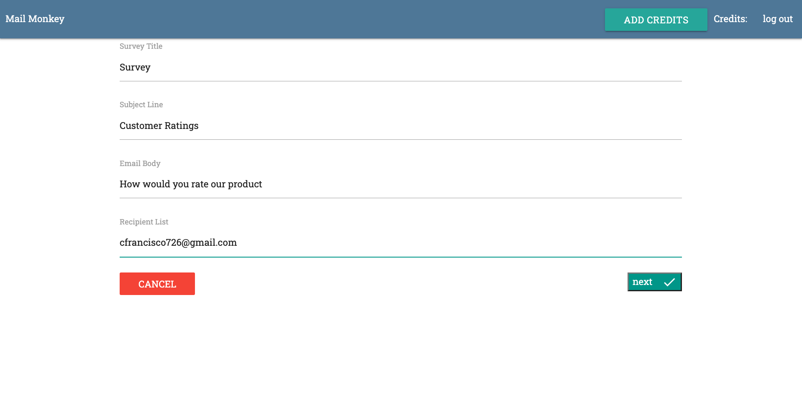

# Mail Monkey

Mail Monkey allows users to send and track surveys via email. Users pay through stripe to add credits in order to send emails to their customers. Their profile page displays a history of the emails sent, along with a bar chart of how their customers responded via email

Current demo is temorarily down

## Description

- Create-React-App that connects to a NodeJS and Express backend
- communicates data from Mongo Atlas database

## Features

- Google OAuth user athentification
- Fill out form to send emails to subscribers
- pay for credits through stripe in order to send survey emails to customers
- display list of surveys sent with a chart displaying what rating was chosen

## Technologies Used

- React
- React Router
- Redux
- Redux Form
- MongoDB
- ExpressJS
- NodeJS
- MaterializeCSS
- React ChartJS

## APIs Used

- Google Oath authentification
  - login google authentification
- Stripe
  - handles credit cards and receives payments from your users with Stripe
- Sendgrid
  - a cloud-based SMTP provider that allows you to send email without having to maintain email servers

## Hosted on

Heroku

## Landing


## Survey Form



## Stripe Checkout


## 🛠️ Installation Steps

Install dependencies

```bash
npm install
```

Use node version 8.1.1

```bash
nvm use 8.1.1
```

### Executing program

Running the following script runs several other scripts: "concurrently \"npm run server\" \"npm run client\" \"npm run webhook\"",

```
npm run dev
```

## Acknowledgments

Inspiration

- [Udemy: Node with React: Fullstack Web Development Stephen Grider](https://www.udemy.com/course/node-with-react-fullstack-web-development/?utm_source=adwords&utm_medium=udemyads&utm_campaign=React_v.PROF_la.EN_cc.US_ti.7450&utm_content=deal4584&utm_term=_._ag_79286082406_._ad_532133511517_._kw__._de_c_._dm__._pl__._ti_dsa-774930034049_._li_9003516_._pd__._&matchtype=&gclid=Cj0KCQiA_8OPBhDtARIsAKQu0gYPBklaqn8bxpLVj2bNvntKRDqrA5E8-HHByQZU5VQeqvJBurB-wVsaAr4gEALw_wcB)
